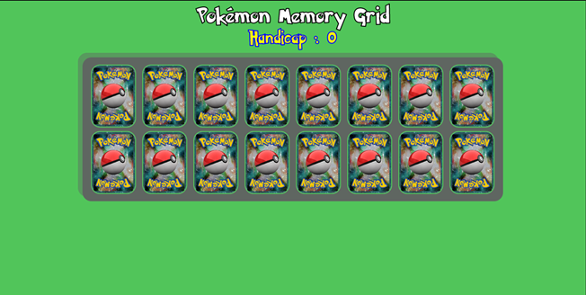
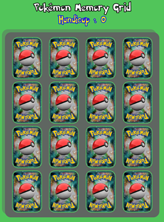

# Pokemon Memory

https://romaryl.github.io/Pokemon-Memory/

Application monopage en HTML/CSS/Javascript/JQuery. Huit images uniques de pokémons sont sélectionnées parmis une liste de 200, les paires sont créer depuis cette liste puis sont mélangées et affichées.
Le score s'incrémente à chaque retournement de carte et décrémente de 1 lorsqu'une paire est trouvée.

## Contexte de développement
Cette application web a été réalisée en tant qu'exercice dans ma formation Développeur Web et Web Mobile à l'AFPA de Brive-la-Gaillarde. Des captures d'écrans du rendu attendu étaient données ainsi que les ressources graphiques.

## Technologies
* HTML5/CSS3
* Bootstrap v5.0.2
* Javascript ECMAScript 2022

## Captures d'écran

### Bootstrap
Les rendus des pages sont réactifs et adaptés à deux formats d'écrans :

#### Desktop

#### Small

